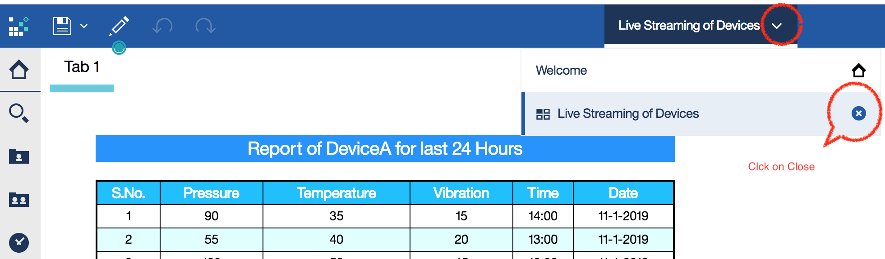

# Display live insights of your device’s health metrics

### Real-time streaming of automotive device data using custom widgets

IBM Cognos Analytics integrates reporting, modeling, analysis, dashboards, stories, and event management so that you can understand your organization data, and make effective business decisions. Just take an example in the Automobile manufacturing unit, one of the key challenging tasks is to monitor the devices and taking an accurate decision of bringing them for planned or un-planned maintenance. From the traditional Cognos analytics (previous to 11.x version) dashboard, it was **NOT** possible to show the volatility and the non-volatile data in a single dashboard. Meaning, the real-time data display was not possible directly. Now with the latest features of Cognos Analytics 11.x, custom widgets can be built to display volatile data and custom widgets can be used through Extensions in Cognos Dashboards.

With the latest feature of Cognos Analytics 11.x Extensions, we have the ability to add and remove elements in the IBM Cognos Analytics user interface for a perspective. An extension is a zip file that contains spec.json, optional images and js folders. You can create extensions that add functions to the IBM Cognos Analytics user interface.

In Automobile manufacturing unit, a plant engineer's job is to continuously monitor the devices health and keep them intact. It is quite a tedious job for him to monitor constantly those devices and take a call to bring the devices down for maintenance. When there is a corrective maintenance task, where equipment is repaired or replaced after wear, malfunction or break down, at that moment going for maintenance is a fair ask. But, if there is preventive/predictive maintenance required based on the previous break down activities, the system/models would have predicted for the device to bring down for maintenance. However, if you really look at the live (real-time) metrics of the devices, he would notice that devices health is absolutely fine and intact, and the plant engineer would not go to an unnecessary (overhead) maintenance. In order to see such live/real-time metrics from the Cognos dashboard, it is not a straight way to build. This code pattern helps us to achieve this functionality with the help of Custom widgets which is built using d3 and js(java scripts).

In this code pattern, we will build a Cognos add-on to consume highly volatile streaming (real-time) data. The real time Dashboard displays mix of data (volatile and non-volatile) on a single dashboard. It shows a dancing chart that captures volatile data and incrementally updates itself. This pattern demonstrates displaying live-insights of the devices health metrics within Cognos Dashboard.

When the reader has completed this Code Pattern, they will understand how to:

* Build Cognos Custom Widgets
* Integrate Java Script built Extension within Cognos Dashboard
* Display mix of Historical and Live Streaming IoT data in Cognos Dashboard
* Interact with widgets within the same Cognos Dashboard

## Flow


1. Develop the code (includes spec.json, js, css, Images) to build Cognos Custom Widget (Extensions).
2. Bundle the code as a zip file.
3. Upload the zipped files into Cognos using Extensions.
4. Use the built custom widget into Cognos Dashboard.


<!--Optionally, update this section when the video is created-->
# Watch the Video

[](https://www.youtube.com/watch?v=234fz-UwPKY "")

<!--[](https://youtu.be/234fz-UwPKY)-->


## Pre-requisites

* Cognos server - Have on-prim or SaaS offering of Cognos.
   > Note: Cognos version should be over 11.0.1.

* To create and upload extensions(Custom Widgets), you must have Cognos Portal Administrator or System Administrator privileges.


# Steps

1. [Get the code](#1-get-the-code)
2. [Upload the zipped files into Cognos using Custom Widgets](#2-upload-the-zipped-files-into-cognos-using-custom-widgets)
3. [Create a Dashboard to use the built Custom Widget](#3-create-a-dashboard-to-use-the-built-custom-widget)
4. [Run the Dashboard](#4-run-the-dashboard)
5. [Analyze the Dashboard](#5-analyze-the-dashboard)


## 1. Get the code

 - Clone the repo using the below command.
   ```
   git clone https://github.com/IBM/cognos-dancing-dashboard
   ```

 - In this repository, custom widget code is available at `./custom-widget-code`.

 -  Custom widget code is provided as zip file (bundled) to upload to Cognos as Custom widgets.The contents of zip file are as follows:

   


## 2. Upload the zipped files into Cognos using Custom Widgets


- Launch Cognos BI server from the browser (Firefox is preferred). Use the url as per your Cognos Instance.

  Sample URL as follows:
   ```
   http://IP(or)localhost:port_number/bi/?perspective=home
   ```

  


- Under Cognos BI web browser, go to the `Manage -> Customization` option. See below screenshot for details.

  


-  Under Customization, use the `Extensions` tab and click on `upload` icon to upload the `CognosCustomWidget.zip` file. CognosCustomWidget.zip file is the part of your [git code](https://github.com/IBM/cognos-dancing-dashboard/tree/master/custom-widget-code). See below screenshot for details.

   


- On success, `File was uploaded successfully` message will be displayed.

  


- The code provided in this repository creates a custom widget for use in dashboards. Hence, a new icon gets created for this newly created Custom Widget on successful upload of the Custom Widget zip file as shown in screenshot. This you can verify later as it appears in the dashboard console.

  


## 3. Create a Dashboard to use the built Custom Widget

- Launch Cognos and create a new dashboard

  


- Select the blank template.

  


- Click on the Newly created Custom Widget Icon.

  


- Drag and drop the Custom Widget to the Dashboard pane. See below screenshot for details.

  


- Adjust the dragged Custom widget to fit to the required height and width within the dashboard.

  


- After adjusting the custom widget would look like below.

  


- Save the dashboard as

  ```
  `Live Streaming of Devices` under `My Content` or any folder of your choice.
  ```

  

- Close the dashboard




## 4. Run the Dashboard

- Run the 'Live Streaming of Devices' dashboard from the saved location.

  

- You will see the dashboard with a list content which has 'DeviceA' last 24 hours data (Pressure, Temperature and Vibration)

  

- Click on any attribute (Pressure/Temperature/Vibration) column cell for live streaming. A pop up will appear to confirm the pressure live chart is going to be displayed.

  

-  See the below Live streaming of the line chart for pressure attribute.

   

- Similarly we can click on other metrics like Temperature and Vibration to see the live streaming of the data in the line chart.

  

- Following are the optional steps to customize the dashboard.
  ```
  * Add back ground color the dashboard
  * Add a title to the dashboard
  * Add mutliple tabs to the dashboard
  ```

  

 ## 5. Analyze the Dashboard

The dashboard displays both volatile and non-volatile data. Meaning, the static data is being read from the json spec (can also be read from any traditional database but for this pattern we restricted to read from json spec) and the real-time data is being read from the json spec through a random number generator (which can be read from IoT device data through REST APIs). This dashboard is primarily useful for Automobiles, manufacturing unit's, where a plant engineer monitors the devices in real-time. For example, if any of these metrics (or) the combinations of the metrics (Pressure/Temperature/Vibration) go beyond the threshold points, then the plant engineer would take a call to bring devices down for maintenance.


# Troubleshooting

* Error: Invalid File Name. (This error occurs while you are trying to upload the Custom widget Extension under Customization)

  

  > This is common error if the files are not bundled appropriately.


# Learn More

- [IBM Cognos Custom Widgets(Extensions)](https://www.ibm.com/support/knowledgecenter/en/SSEP7J_11.0.0/com.ibm.swg.ba.cognos.ag_manage.doc/c_ag_manage_extensions.html)

- [How to create Extensions](https://www.youtube.com/watch?v=1yzgM_-Bf-4)


<!-- keep this -->
## License

This code pattern is licensed under the Apache Software License, Version 2. Separate third-party code objects invoked within this code pattern are licensed by their respective providers pursuant to their own separate licenses. Contributions are subject to the [Developer Certificate of Origin, Version 1.1 (DCO)](https://developercertificate.org/) and the [Apache Software License, Version 2](https://www.apache.org/licenses/LICENSE-2.0.txt).

[Apache Software License (ASL) FAQ](https://www.apache.org/foundation/license-faq.html#WhatDoesItMEAN)
